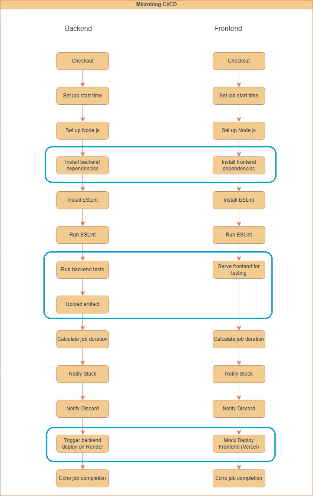
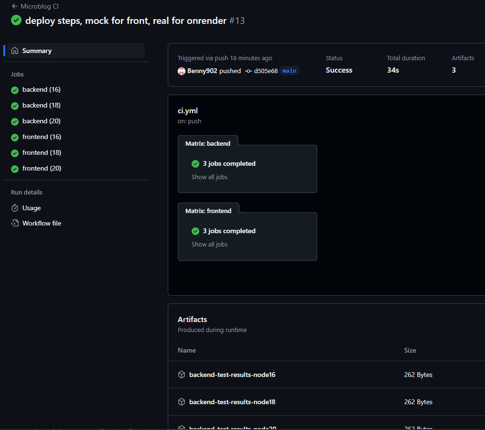
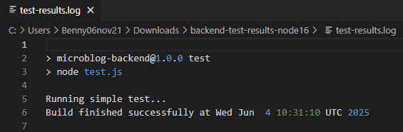
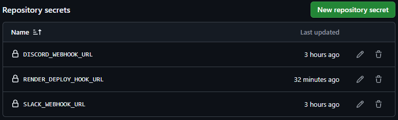
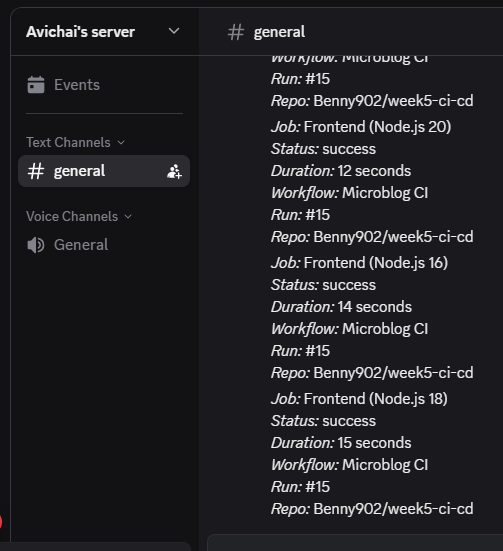
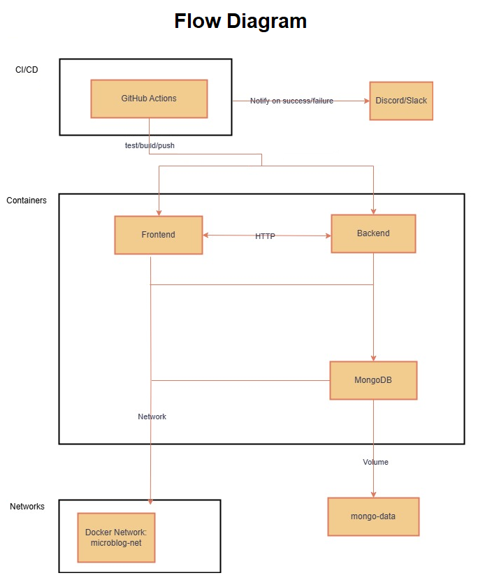

# Benny &amp; Avichai - week 6 collaboration


### this week 6 is build on top of week 5:

<details>
<summary> # week5-ci-cd </summary>

# Benny &amp; Avichai - week 5 collaboration


## Microblog Project

### A simple microblog project to demonstrate CI/CD using GitHub Actions.

### Backend (https://week5-ci-cd.onrender.com)

### Frontend (https://week5-ci-cd.vercel.app/)

### GitHub Actions (Runs backend and frontend tasks separately on every push/pull request.)


<hr>

## Introduction to GitHub Actions

- **What is a GitHub Action?**  
  A GitHub Action is an automated workflow step or script that runs in response to events (like code pushes, pull requests, or issues). It’s used for tasks like building, testing, and deploying the application.

- **What is the difference between a job and a step?**  
  - A **job** is a set of steps that run on the same runner (virtual machine). Jobs run in parallel by default, we can use 'needs' within a job to wait for other job to finish.
  - A **step** is a single task within a job (like `npm install` or `echo "Hello"`). Steps run sequentially within a job.

- **What triggers a workflow?**  
  Workflows are triggered by events (like `push`, `pull_request`, `workflow_dispatch`), a schedule (cron), or manually from the GitHub Actions UI.

---

## CI/CD Flowchart:  
 

---
## Basic CI Pipeline for Testing
1. In the project’s root, creating a new folder `.github/workflows`.  
2. Inside `.github/workflows`, create a file named `ci.yml`.  
3. Heres the basic template we started with for a Node.js app:

```yaml
name: CI Pipeline

on: # Runs on every push and pull request
  push:
  pull_request:

jobs:
  test:
    runs-on: ubuntu-latest
    steps:
      - uses: actions/checkout@v3
      - name: Set up Node.js
        uses: actions/setup-node@v3
        with:
          node-version: '18'
      - run: npm install # Installs dependencies
      - run: npm test # Runs test script
```

---

## Matrix Strategy
1. modifying the `ci.yml` file to include a matrix strategy:  

```yaml
    strategy:
      matrix: # Defines a matrix for versions
        node-version: [16, 18, 20]

    steps:
        with:
          node-version: ${{ matrix.node-version }}
```

we can confirm the workflow runs once for each version by checking the 'GitHub Actions' run results.  
for example in our case:  
https://github.com/Benny902/week5-ci-cd/actions/runs/15439997140

 
---

## Artifacts and Post-job Monitoring

In the **backend job**, we add a step to upload the test log file as an artifact:  

```yaml
- name: Upload test results
  uses: actions/upload-artifact@v4
  with:
    name: backend-test-results-node${{ matrix.node-version }}
    path: backend/test-results.log
```
we can download an artifact zip file from the link above, and see it has 'test-results.log' file inside of it, which shows:

 

---

## GitHub Secrets
### In our repository - > Settings -> Actions -> New repository Secret.

 
---

## Slack/Discord Integration
1. Integrate the workflow with Slack and Discord (we did both)
2. Store the webhook URL in the GitHub repo secrets (`SLACK_WEBHOOK_URL` and `DISCORD_WEBHOOK_URL`).  
3. Add both Discord and Slack notification step to the workflow (for backend and frontend accordingly):  

```yaml
      - name: Notify Slack (Backend)
        if: always() # always run this step even if tests fail
        uses: slackapi/slack-github-action@v1.25.0 # Use official Slack GitHub Action
        with:
          payload: |
            {
              "text": "*Job:* Backend (Node.js ${{ matrix.node-version }})\n*Status:* ${{ job.status }}\n*Duration:* ${{ env.JOB_DURATION }} seconds\n*Workflow:* ${{ github.workflow }}\n*Run:* #${{ github.run_number }}\n*Repo:* ${{ github.repository }}"
            }
        env:
          SLACK_WEBHOOK_URL: ${{ secrets.SLACK_WEBHOOK_URL }} # Slack webhook URL stored in GitHub secrets

      - name: Notify Discord (Backend) # here we use a different method, we use POST to the DISCORD_WEBHOOK_URL, because there is no official GitHub Action for Discord
        if: always() # always run this step even if tests fail
        run: |
          STATUS="Failed"
          if [ "${{ job.status }}" == "success" ]; then
            STATUS="Succeeded"
          fi

          curl -H "Content-Type: application/json" \
              -X POST \
              -d "{\"content\": \"*Job:* Backend (Node.js ${{ matrix.node-version }})\n*Status:* ${{ job.status }}\n*Duration:* ${{ env.JOB_DURATION }} seconds\n*Workflow:* ${{ github.workflow }}\n*Run:* #${{ github.run_number }}\n*Repo:* ${{ github.repository }}\"}" \
              ${{ secrets.DISCORD_WEBHOOK_URL }}
```
Screenshot of the outcome:   
Slack:  
 

Discord:  
 

---
## Used cache to improve performance:
```yaml
  - name: Set up Node.js
    uses: actions/setup-node@v3
    with:
        node-version: ${{ matrix.node-version }}
        cache: 'npm'
        cache-dependency-path: backend/package-lock.json

```
- `actions/setup-node@v3` automatically enables caching of the ~/.npm directory (where npm stores downloaded packages).
- `node-version:` ensures the cache is scoped per Node.js version — different versions create different caches.
- `cache: 'npm'` activates built-in npm dependency caching (no need for manual restore/save steps).
- `cache-dependency-path:` defines which file (here backend/package-lock.json) is hashed to generate the cache key — if this file changes, a new cache is created.

---

## Used linter tool (ESLint):
```yaml
      - name: Install ESLint
        run: npm install -g eslint

      - name: Run ESLint
        run: npx eslint .
        working-directory: backend
```
We use ESLint to enforce code quality.  
It checks .js files for missing semicolons (error), unused variables (warn), and allows console statements (e.g console.log).  
The rules are defined in a config file (eslint.config.js) and executed with npx `eslint .` .  

---

## Deployement steps:
```yaml
  backend:
    steps:
      - name: Trigger backend deploy on Render
        if: github.event_name == 'workflow_dispatch' || (github.event_name == 'push' && github.ref == 'refs/heads/main')
        run: curl -X POST ${{ secrets.RENDER_DEPLOY_HOOK_URL }}

  frontend:
    steps:
      - name: Mock Deploy Frontend (Vercel)
        if: github.event_name == 'workflow_dispatch' || (github.event_name == 'push' && github.ref == 'refs/heads/main')
        run: echo "Frontend automatically deployed by Vercel"
```
both render and vercel deploy automatically, but we wanted to show the difference and the possibility to deploy manualy, as we can see here on the Render deploy we use 'RENDER_DEPLOY_HOOK_URL' and deploy manually, but on the Vercel deploy we just display an echo because it deploys automatically after every push to the main.  
`if: github.event_name == 'workflow_dispatch' || (github.event_name == 'push' && github.ref == 'refs/heads/main')`: means it will only activate those deploys if its push in main, or clicked manually in the github actions (workflow_dispatch)

---


## Combined Frontend and Backend CI/CD (`Full cicd.yml` file):

<details>
<summary> Created simple backend and frontend folder and files and enhanced the yml, this is the final yml file: </summary>

```yaml
name: Microblog CI

on:
  push: # Runs on every push
  pull_request: # Runs on pull request
  workflow_dispatch: # Can be run manually

jobs:

  backend:
    runs-on: ubuntu-latest
    strategy:
      matrix: # Matrix strategy to test multiple Node.js versions
        node-version: [16, 18, 20]

    steps:
      - uses: actions/checkout@v3

      - name: Set job start time
        run: echo "JOB_START_TIME=$(date +%s)" >> $GITHUB_ENV # Record the start time in seconds and store it in GitHub Actions environment variable

      - name: Set up Node.js
        uses: actions/setup-node@v3
        with:
          node-version: ${{ matrix.node-version }} # Use the Node.js version from the matrix
          cache: 'npm'
          cache-dependency-path: backend/package-lock.json

      - name: Install backend dependencies
        run: |
          if [ "${{ matrix.node-version }}" < "18" ] ; then
            npm install
          else
            npm ci
          fi
        working-directory: backend

      - name: Install ESLint
        run: npm install -g eslint

      - name: Run ESLint
        run: npx eslint .
        working-directory: backend

      - name: Run backend tests
        run: |
          npm test | tee test-results.log
          echo "Build finished successfully at $(date)" >> test-results.log
        working-directory: backend

      - name: Upload test results
        uses: actions/upload-artifact@v4
        with:
          name: backend-test-results-node${{ matrix.node-version }}
          path: backend/test-results.log

      - name: Calculate job duration
        run: echo "JOB_DURATION=$(( $(date +%s) - $JOB_START_TIME ))" >> $GITHUB_ENV # Calculate duration in seconds and store in environment variable

      - name: Notify Slack (Backend)
        if: always() # always run this step even if tests fail
        uses: slackapi/slack-github-action@v1.25.0 # Use official Slack GitHub Action
        with:
          payload: |
            {
              "text": "*Job:* Backend (Node.js ${{ matrix.node-version }})\n*Status:* ${{ job.status }}\n*Duration:* ${{ env.JOB_DURATION }} seconds\n*Workflow:* ${{ github.workflow }}\n*Run:* #${{ github.run_number }}\n*Repo:* ${{ github.repository }}"
            }
        env:
          SLACK_WEBHOOK_URL: ${{ secrets.SLACK_WEBHOOK_URL }} # Slack webhook URL stored in GitHub secrets

      - name: Notify Discord (Backend) # here we use a different method, we use POST to the DISCORD_WEBHOOK_URL, because there is no official GitHub Action for Discord
        if: always() # always run this step even if tests fail
        run: |
          STATUS="Failed"
          if [ "${{ job.status }}" == "success" ]; then
            STATUS="Succeeded"
          fi

          curl -H "Content-Type: application/json" \
              -X POST \
              -d "{\"content\": \"*Job:* Backend (Node.js ${{ matrix.node-version }})\n*Status:* ${{ job.status }}\n*Duration:* ${{ env.JOB_DURATION }} seconds\n*Workflow:* ${{ github.workflow }}\n*Run:* #${{ github.run_number }}\n*Repo:* ${{ github.repository }}\"}" \
              ${{ secrets.DISCORD_WEBHOOK_URL }}

      - name: Trigger backend deploy on Render
        if: github.event_name == 'workflow_dispatch' || (github.event_name == 'push' && github.ref == 'refs/heads/main')
        run: curl -X POST ${{ secrets.RENDER_DEPLOY_HOOK_URL }}

      - name: Echo job completion
        if: success() # Only run if job was successful
        run: echo "Backend job for Node.js ${{ matrix.node-version }} completed successfully!" # Bash echo to log success message


  frontend:
    runs-on: ubuntu-latest
    strategy:
      matrix:
        node-version: [16, 18, 20]

    steps:
      - uses: actions/checkout@v3

      - name: Set job start time
        run: echo "JOB_START_TIME=$(date +%s)" >> $GITHUB_ENV # Record the job start time

      - name: Set up Node.js
        uses: actions/setup-node@v3
        with:
          node-version: ${{ matrix.node-version }} # Use matrix version
          cache: 'npm'
          cache-dependency-path: frontend/package-lock.json

      - name: Install frontend dependencies
        run: |
          if [ "${{ matrix.node-version }}" < "18" ] ; then
            npm install
          else
            npm ci
          fi
        working-directory: frontend

      - name: Install ESLint
        run: npm install -g eslint

      - name: Run ESLint
        run: npx eslint .
        working-directory: frontend

      - name: Serve frontend for testing # Start a local server and check if it's running
        run: |
          node server.js &
          sleep 3
          curl -I http://localhost:4000
        working-directory: frontend

      - name: Calculate job duration
        run: echo "JOB_DURATION=$(( $(date +%s) - $JOB_START_TIME ))" >> $GITHUB_ENV # Calculate how long the job took

      - name: Notify Slack (Frontend)
        if: always() # Always send Slack message
        uses: slackapi/slack-github-action@v1.25.0
        with:
          payload: |
            {
              "text": "*Job:* Frontend (Node.js ${{ matrix.node-version }})\n*Status:* ${{ job.status }}\n*Duration:* ${{ env.JOB_DURATION }} seconds\n*Workflow:* ${{ github.workflow }}\n*Run:* #${{ github.run_number }}\n*Repo:* ${{ github.repository }}"
            }
        env:
          SLACK_WEBHOOK_URL: ${{ secrets.SLACK_WEBHOOK_URL }}

      - name: Notify Discord
        if: always()
        run: |
          STATUS="Failed"
          if [ "${{ job.status }}" == "success" ]; then
            STATUS="Succeeded"
          fi

          curl -H "Content-Type: application/json" \
              -X POST \
              -d "{\"content\": \"*Job:* Frontend (Node.js ${{ matrix.node-version }})\n*Status:* ${{ job.status }}\n*Duration:* ${{ env.JOB_DURATION }} seconds\n*Workflow:* ${{ github.workflow }}\n*Run:* #${{ github.run_number }}\n*Repo:* ${{ github.repository }}\"}" \
              ${{ secrets.DISCORD_WEBHOOK_URL }}

      - name: Mock Deploy Frontend (Vercel)
        if: github.event_name == 'workflow_dispatch' || (github.event_name == 'push' && github.ref == 'refs/heads/main')
        run: echo "Frontend automatically deployed by Vercel"

      - name: Echo job completion
        if: success()
        run: echo "Frontend job for Node.js ${{ matrix.node-version }} completed successfully!" # Echo final success message for the job
```

</details>


<br><hr><br>

# REFLECTION.MD

## Learned:
We learned how to create a full CI/CD pipeline using GitHub Actions, including build, lint, test, artifact upload, and notifications. We used matrix builds to test across multiple Node.js versions and added caching for faster installs.

## Challenges:
The main challenge was restricting deployment to only run on pushes to main or manual triggers.  
We also had to manage step ordering and handle conditional logic within matrix jobs.

### we solved the deploy restriction by:  
 `github.event_name == 'workflow_dispatch' || (github.event_name == 'push' && github.ref == 'refs/heads/main')`  
 which means it will only activate those deploys if its push in main, or clicked manually in the github actions (workflow_dispatch)

### we solved the matrix issue by:  
 ```yaml
          if [ "${{ matrix.node-version }}" < "18" ] ; then
            npm install
          else
            npm ci
          fi
 ```
which means if the node is under 18 it will use `npm install` and if its 18 or higher it will use `npm ci`

- npm install installs dependencies listed in package.json, and may update package-lock.json.
- npm ci strictly installs from package-lock.json, is faster, and ensures a clean, reproducible install — ideal for CI pipelines.

## Improvements:
For a production pipeline, we would add test coverage checks, separate deploys for staging and production, and include security scans. Reusable workflows would also help reduce duplication and improve maintainability.

</details>
<hr>

# Week 6 – Summary Task: Docker & Containerization

## Overview

This week, we continued our DevOps project by fully containerizing the microblog application with Docker, orchestrating multi-container environments using Docker Compose, and integrating a CI/CD pipeline with GitHub Actions for the build images and push.  
The solution demonstrates containerization best practices, automated build/test/deploy flows, and team collaboration.

---

## 1. Application Architecture & Flow Diagram

The application consists of three main containers:

- **Frontend**: Node.js + Express static server (serves the UI)
- **Backend**: Node.js + Express REST API (handles blog data)
- **Database**: MongoDB container with persistent Docker volume

All containers communicate on a custom Docker network. The backend talks to MongoDB via the network, while the frontend interacts with the backend over HTTP.

**CI/CD** is managed by GitHub Actions: it builds images, runs tests, tags images, and deploys on push to main.

### Application Flow Diagram


---

## 2. Dockerization

Each service (frontend, backend) has a `Dockerfile`:

**Example `Dockerfile` for Backend:**
```dockerfile
# Use a lightweight Node.js image
FROM node:18-alpine

# Set working directory
WORKDIR /app

# Copy package.json and install dependencies
COPY package*.json ./
RUN npm install

# Copy all files
COPY . .

HEALTHCHECK --interval=30s --timeout=5s --retries=3 CMD curl -f http://localhost:3000/ || exit 1

# Run the server
CMD ["node", "server.js"]
```

### also added `.dockerignore`:
```
node_modules
.env
```
#### How `.dockerignore` affects build context:  
This will prevent the node_modules and .env files from being copied into the Docker image.  
- This reduces build context size (making builds faster).  
- `node_modules`: It ensures Docker installs fresh dependencies inside the container, avoiding possible OS or version conflicts.  
- keep sensitive files (like .env) out of production image.


## 3. Docker Compose & Networking
The project uses a single docker-compose.yml file to orchestrate all containers.

- Defines frontend, backend, and mongo services

- Connects all containers to the same custom network (microblog-net)

- Mounts a volume for MongoDB data (mongo-data)

### our `docker-compose.yml`:
```yml
version: '3.8'

services:
  mongo:
    image: mongo:6
    ports:
      - "27017:27017"
    volumes:
      - mongo-data:/data/db
    networks:
      - microblog-net

  backend:
    build: ./backend
    image: myapp-backend:${APP_VERSION:-latest}
    ports:
      - "3000:3000"
    depends_on:
      - mongo
    environment:
      - MONGO_URL=mongodb://mongo:27017/microblog
    volumes:
      - ./backend:/app
    networks:
      - microblog-net

  frontend:
    build: ./frontend
    image: myapp-frontend:${APP_VERSION:-latest}
    ports:
      - "4000:4000"
    depends_on:
      - backend
    volumes:
      - ./frontend:/app
    networks:
      - microblog-net

volumes:
  mongo-data:

networks:
  microblog-net:
    driver: bridge
```

### To start everything (locally, and need to have docker installed):
```bash
docker-compose up --build
```

- Frontend: http://localhost:4000

- Backend API: http://localhost:3000

- MongoDB: mongodb://localhost:27017/microblog

## 4. Healthchecks & Image Tagging
#### HEALTHCHECK instructions are added in Dockerfiles for backend and frontend.
```dockerfile
HEALTHCHECK --interval=30s --timeout=5s --retries=3 CMD curl -f http://localhost:3000/ || exit 1
```

#### Images are tagged using Semantic Versioning (myapp-backend:1.0.0, myapp-frontend:1.0.0) when building and pushing via CI/CD.
- for example in local with docker-compose:
```yml
image: myapp-backend:${APP_VERSION:-latest}
```

- and in github actions (in deploy):
```yml
      - name: Build Docker image
        run: |
          docker build -t ${{ secrets.DOCKERHUB_USERNAME }}/myapp-backend:${{ inputs.tag }} ./backend

      - name: Push Docker image
        run: |
          docker push ${{ secrets.DOCKERHUB_USERNAME }}/myapp-backend:${{ inputs.tag }}
```
the tag is passed to the build file from the main cicd file using `with: tag: ${{ github.ref_name }}`:
```yml
  backend-docker-build:
    needs: backend-test
    uses: ./.github/workflows/docker-build-backend.yml
    with:
      tag: ${{ github.ref_name }}
    secrets: inherit
```

## 5. GitHub Actions CI/CD
### The pipeline does the following on each push and PR:

- Installs dependencies

- Runs lint and tests

- Builds Docker images with semantic version tags (derived from Git tags like v1.0.0)

- Pushes images to Docker Hub (requires secrets)

- Deploys (via Render/Vercel backend/frontend)

- Notifies Slack and Discord with build/test status (always runs notifications, even on failure!)

### Simplified pipeline into Reusable workflows that also help reduce duplication and improve maintainability:
### main `cicd.yml` file:
```yml
name: Microblog CICD

on:
  push: # Runs on every push
      tags:
      - 'v*.*.*'
  pull_request: # Runs on pull request
  workflow_dispatch: # Can be run manually

jobs:

  backend-test:
    uses: ./.github/workflows/backend-test.yml

  backend-docker-build:
    needs: backend-test
    uses: ./.github/workflows/docker-build-backend.yml
    with:
      tag: ${{ github.ref_name }}
    secrets: inherit

  backend-notify:
    needs: [backend-test, backend-docker-build]
    if: always()
    uses: ./.github/workflows/notify-backend.yml
    with:
      job_start_time: ${{ needs.backend-test.outputs.job_start_time }}
      test_status: ${{ needs.backend-test.result }}
      build_status: ${{ needs.backend-docker-build.result }}
    secrets: inherit

  frontend-test:
    uses: ./.github/workflows/frontend-test.yml

  frontend-docker-build:
    needs: frontend-test
    uses: ./.github/workflows/docker-build-frontend.yml
    with:
      tag: ${{ github.ref_name }}
    secrets: inherit

  frontend-notify:
    needs: [frontend-test, frontend-docker-build]
    if: always()
    uses: ./.github/workflows/notify-frontend.yml
    with:
      job_start_time: ${{ needs.frontend-test.outputs.job_start_time }}
      test_status: ${{ needs.frontend-test.result }}
      build_status: ${{ needs.frontend-docker-build.result }}
    secrets: inherit
```